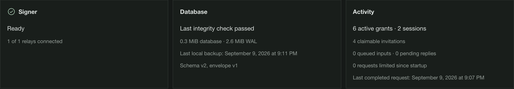
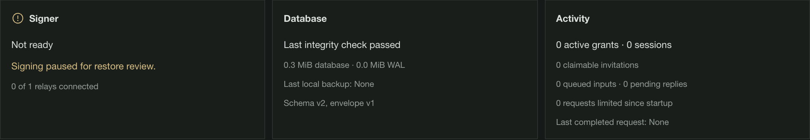
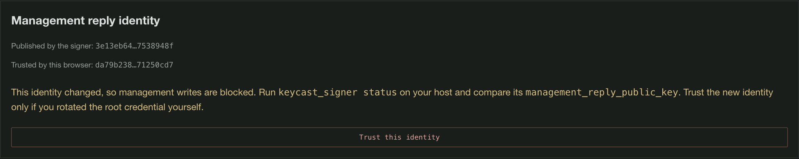

# Backup and recovery

[Documentation](README.md) · [Operations](operations.md) · [Deployment](deployment.md)

These commands run on the trusted host as the account that owns the database and root credential.
Set `KEYCAST_DATABASE_PATH`, `KEYCAST_MIGRATIONS_PATH`, and `KEYCAST_ROOT_KEY_FILE` to the
intended instance. In Docker, use the signer image with its database/root mounts and an additional
private backup-directory mount; paths below are examples inside that execution environment.
See [CLI execution](operations.md#running-host-commands) before using the examples.

## Backup

Generate a dedicated backup encryption key once. It must differ from the root credential; the CLI
rejects reuse of the root as the backup key. The backup key protects a complete bundle containing
both a consistent SQLite snapshot and its root credential. Losing the backup key makes the bundle
unrecoverable. Store a recovery copy separately from the backup files and from the VM.

```sh
keycast_signer generate-key /secure/keycast-backup.key
keycast_signer backup /secure/keycast-backup.key /backups/keycast-YYYYMMDD-HHMMSS.kcb
```

Backup can run while the signer is active. `VACUUM INTO` includes committed WAL contents and produces
a compact snapshot; the maintenance lock prevents root rotation during the snapshot. Output files
are created with mode 0600, synced, and never overwritten. The binary authenticated format contains
no JSON expansion of the database. The KCB3 format streams independently authenticated 1 MiB chunks, with an authenticated manifest
binding the root credential, database length, archive identity and chunk positions. Truncation,
reordering and mixing archives fail authentication. The supported compact database bound is 256 MiB,
matching the clean database page ceiling; memory use does not scale with the whole backup. Temporary snapshots are
private files in the database directory, removed after the command. An abrupt host failure may leave
a `snapshot-*` file there; it contains the encrypted database, not the root credential.

Schedule the command with the host's service manager, upload the resulting encrypted file to the
chosen off-host store, and alert on job failure/backup age. A local file is not disaster protection
against loss of the VM. Deployment does not automatically configure an upload destination or enable host timers.



*The demo after a successful encrypted online backup. This timestamp does not establish an off-host copy.*

## Recovery after loss or rollback

An ordinary restart preserves sessions. Restoring an older backup is different: it can resurrect
revoked permissions, invitations, and administrators. Always use the restore command, rather than
copying a historical database into a running instance.

```sh
keycast_signer restore /secure/keycast-backup.key /backups/keycast-YYYYMMDD-HHMMSS.kcb /secure/new-keycast
```

The destination must not exist. Restore checks authentication, schema, root-key pairing and database
integrity. It creates a new instance identity, clears old request caches/approvals, revokes all old
grants/invitations/sessions, and sets a recovery hold. The directory contains `keycast-v2.db` and
`root.key`. A failed restore retains `RESTORE_INCOMPLETE`; the daemon refuses to start it.



*A real restore of the demo archive: signing stays paused and old client access is revoked until review and fresh pairing.*

Review restored team administrators, policy documents, relay settings, and the host allowlists.
Management remains available during the hold so external administrators can repair state. Stop the
signer, point the CLI at the restored database/root, and explicitly record the review:

```sh
keycast_signer review-restore
```

Restart, create fresh grants and invitations, and reconnect clients. Recording the review never
reactivates the old grants. Rehearse this procedure with a disposable copy before relying on backups.

## Root credential rotation

```sh
keycast_signer generate-key /secure/keycast-next-root.key
# Stop the signer; leave KEYCAST_ROOT_KEY_FILE pointing to the old root for this command.
keycast_signer rotate-root /secure/keycast-next-root.key
```

Rotation rewraps every active and revoked key/grant envelope in one SQLite transaction. Both key
files remain intact. After success, configure the signer to load the new root and restart. The old
root fails the database fingerprint check. If interrupted, the database uses either the old or new
root; both files are retained for recovery. The management reply identity also changes; compare the new fingerprint with the trusted host
status and re-trust it in each browser using the **Instance** page. See
[management approvals](security.md#management-approvals). Take and verify a new backup before retiring the old key.
Rotation after compromise does not undo disclosure of plaintext keys or old backups.



*Root rotation produces a new reply identity. Verify it against the trusted host before using the re-trust control.*

## Automating off-host backups

Follow [host monitoring and off-host jobs](operations.md#host-monitoring-and-off-host-jobs)
to schedule encrypted uploads, verify remote copies, retain local archives, and alert on backup age.
