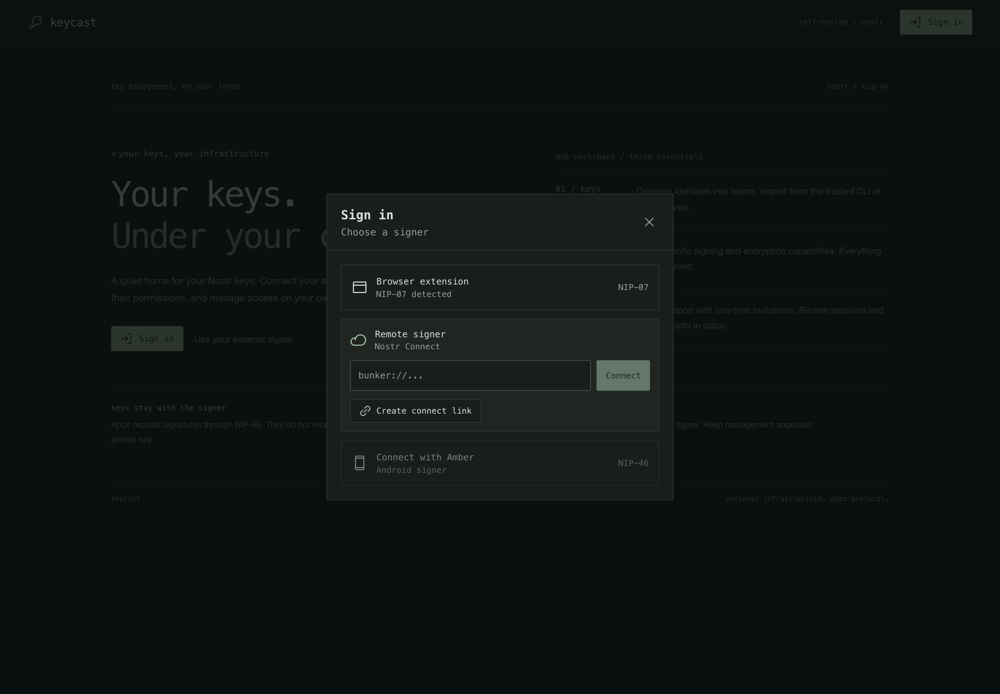
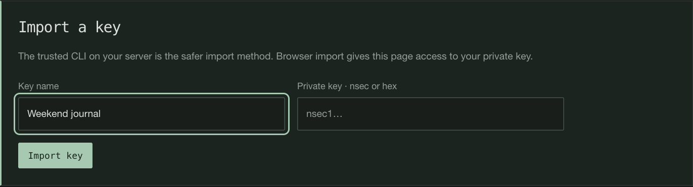
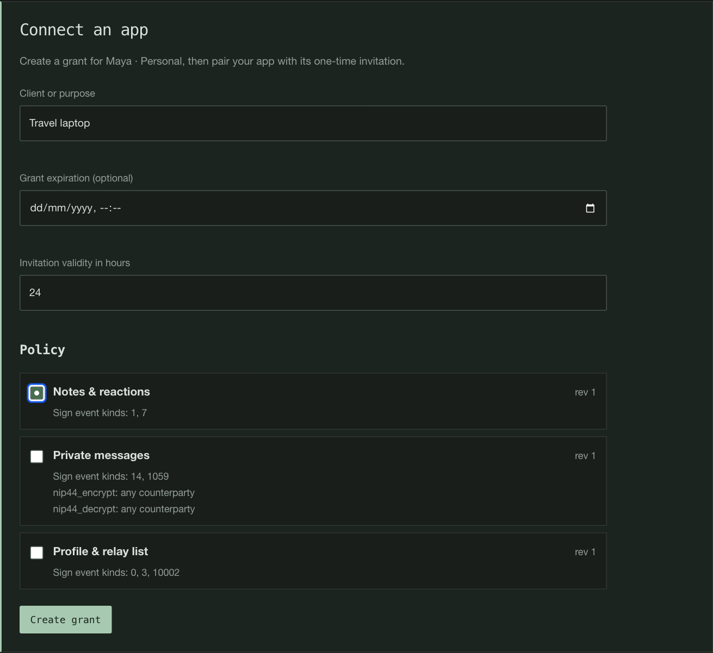
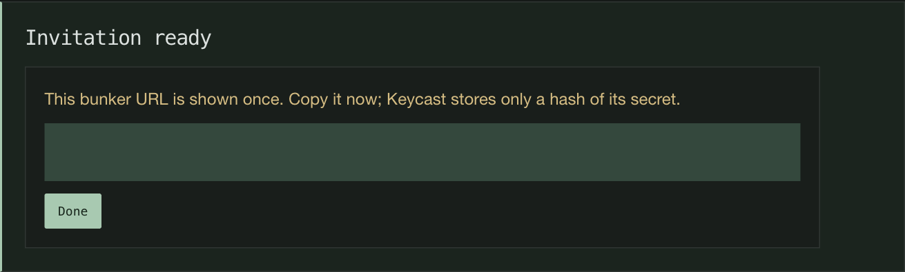

# Getting started

[Documentation](README.md) · [Policies and access](policies-and-access.md)

This guide assumes you have access to a running Keycast instance. To set up your own, start with
[Deployment](deployment.md).

## Two connections, two purposes

You use an external signer to sign in to the **Keycast management UI** and approve changes.
Separately, you connect your **Nostr apps** to Keycast so they can use a hosted key under a policy.

The management identity and hosted identity can be the same Nostr key, but you must keep that
identity available in an external signer. Keycast cannot approve its own management requests.
Sign-in supports a NIP-07 browser extension, Amber/NIP-55 clipboard signing, or another NIP-46
signer. That signer must allow Keycast's private management event kinds. See
[management approvals](security.md#management-approvals).

The instance operator must add your public key to the instance admission allowlist. Being a
team member alone does not bypass it. A Nostr app connecting through a grant does not need its
client public key on that management allowlist.

*Choose the external signer that holds your management identity.*

## Connect your first app

1. **Sign in.** Open the instance in your browser and connect your external signer.
   Review the hostname and command when it asks you to approve an action. Have the operator verify
   the management-reply fingerprint against the trusted host before relying on the first-use pin.
2. **Create or open a team.** A team groups keys, policies, and members. A personal instance can
   use a single team. The creator becomes its administrator; the following steps require that role.
3. **Import a key.** Open **Keys** and choose **Import key**. Give it a name and supply an nsec
   or hex private key. Browser import gives the page and API access to that key during import;
   [trusted CLI import](operations.md#key-import) avoids that path. Start with a disposable key
   while learning the workflow.
4. **Create a policy.** In **Policies**, allow only the operations your app needs. For a simple
   posting test, allow event kind `1`; reactions also need kind `7`. Other features may need other
   kinds or encryption permissions. See [policy examples](policies-and-access.md#policy-examples).
5. **Connect an app.** Open the key and choose **Connect app**. Name the client or purpose,
   select the policy, and choose any grant expiration and the invitation validity period.
6. **Copy the invitation.** Keycast displays the `bunker://` URL once. Paste it into your app's
   Nostr Connect, remote signer, or bunker login field before it expires. Treat the complete URL
   as a secret; do not include it in screenshots, issues, or logs.
7. **Try an allowed action.** Confirm that the app uses the expected public key and can perform
   an operation permitted by the policy. Check the key's active session count and the team's
   **Activity** view. An instance operator can inspect relay and signing health on **Instance**.

Pairing consumes the invitation and establishes a session tied to that client's public key.
The invitation is not a reusable login link for all your devices. Ordinary signer restarts preserve
sessions; clients must retain their own connection identity to resume them.

### What pairing looks like

*Name the identity you are importing. The private-key field is deliberately empty here.*

*Choose a policy for this app and a limited time to claim its invitation.*

*The invitation appears once. Its complete URL is hidden in this screenshot.*

## Add another device or change access

Create a separate grant for each app or device when you want to revoke them independently.
You can also create a **New invitation** on an existing grant to add a session under the same policy.

Invitation validity defaults to 24 hours in the UI and is capped at seven days. An invitation
cannot outlive its grant. A grant may have no expiration for unattended use.

If an invitation expires or you lose its URL, revoke it if still open and create another. Revoking
an unclaimed invitation does not disconnect existing sessions. Revoking the grant ends all its
sessions and remaining invitations. Editing a policy affects subsequent requests for every grant
that uses it. [Policies and access](policies-and-access.md) explains these boundaries in detail.

## If something does not work

| Symptom | What to check |
|---|---|
| Management sign-in or approval is denied | Use an external signer; ask the operator to check the admission allowlist and your team role. |
| The management reply identity changed | Ask the operator to compare the new fingerprint against trusted host status. Only re-trust it on **Instance** after verification, for example after root rotation. |
| A management change returns `409` | Refresh state and request a fresh approval. If a reply was lost, check whether the change already committed before recreating it. |
| A new app cannot pair | Check invitation expiry/consumption and whether the app can reach an advertised relay. Create a fresh invitation for a new client identity. |
| The app connects but an action is denied | Check event kinds, separate encryption/decryption permissions, grant expiry, and any narrower permissions the client requested. |
| Signing times out | Ask the operator to check signing readiness and accepted relay subscriptions. A connected WebSocket alone does not prove signing is available. |

Client support for relay switching varies. Keep working baseline routes available when changing
relay settings; see [Relays](relays.md).
