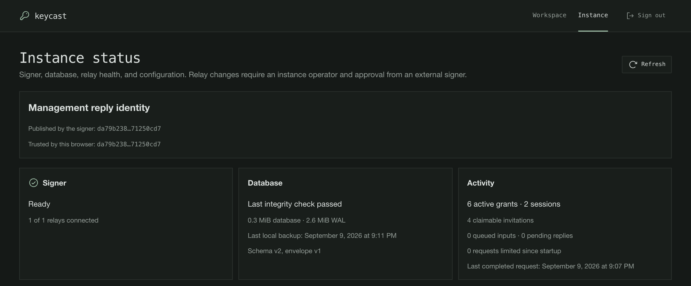
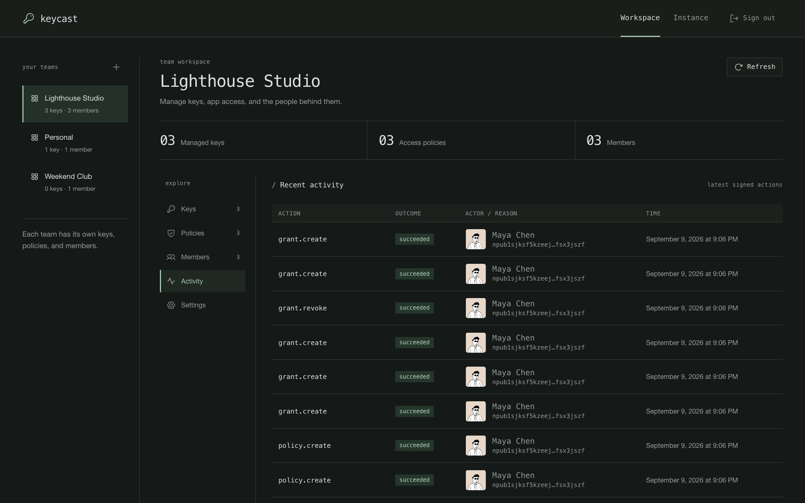

# Operations

[Documentation](README.md) · [Deployment](deployment.md) · [Backup and recovery](backup-and-recovery.md)

Keycast uses one active signer on one host. Only the signer opens SQLite and the root credential.
The API forwards signed requests over a read-only socket mount. Keep the same Nostr identity in an
external NIP-07/NIP-55/NIP-46 signer for management approvals; it may also be imported into Keycast.
Keycast itself refuses to sign management kinds 27236 and 27237 regardless of policy.
For the full trust model, see [Security](security.md).

## Instance status and access

Open **Instance** as an admitted operator to inspect signing readiness, root and management-reply fingerprints, active
resource counts, relay checkpoints, and storage/backlog usage. Team **Activity** shows retained
redacted actions. The [relay guide](relays.md#read-diagnostics) explains connection and delivery
counters; a healthy API alone does not establish signing readiness.

`ALLOWED_PUBKEYS` controls management admission. `KEYCAST_OPERATOR_PUBKEYS` independently controls
instance status and global relay changes. Each team checks its own administrators. Initialization
defaults operators to the first allowed key; use `--operator-pubkeys` to choose them separately.
The signer requires `KEYCAST_PUBLIC_URL=https://HOST/api` (loopback HTTP is allowed for development).
See [Deployment](deployment.md) for configuration.

Management changes require a fresh external approval. Concurrent changes can return `409`; refresh
state and obtain a new approval. If the reply was lost, check whether the command committed before
retrying creation. Each identity can consume at most 128 approval nonces per ten minutes. Rejected
commands cannot consume another identity's budget or advance the authority revision. See
[management approvals](security.md#management-approvals) for the complete signing contract.

After a root rotation, compare the management-reply identity reported by the trusted CLI with
the browser before using the **Instance** page to trust it again. See
[management approvals](security.md#management-approvals).



*Use Instance for signer health and global configuration. See the [operator screenshot tour](screenshots.md#instance-operations) for the remaining panels.*

## Running host commands

For a running production container, query redacted status from the repository root:

```sh
sudo docker compose -f docker-compose.prod.yml exec -T keycast-signer /app/keycast_signer status
```

For offline commands, stop `keycast-signer` first and use a one-off container with its existing
mounts. For example, after creating the team in the UI:

```sh
sudo docker compose -f docker-compose.prod.yml stop keycast-signer
sudo docker compose -f docker-compose.prod.yml run --rm --no-deps -T keycast-signer \
  import TEAM_ID ADMIN_HEX 'Personal key' < /secure/private-key.txt
sudo docker compose -f docker-compose.prod.yml up -d keycast-signer
```

Replace the public team/admin identifiers before running. For backups and rotation, explicitly mount
the private source/destination directories too; a container cannot see host `/secure` or `/backups`
paths unless you mount them. Mount inputs read-only where possible and make output directories
writable by UID/GID `10001`. The API and web containers are not CLI execution environments.

## Key import

Browser import is supported over HTTPS. It uses a password field, avoids storage/caching, clears the
form after attempting import, and excludes the private key from the external approval event.
It still exposes the supplied key to the browser, served frontend, and API during import. A
compromised frontend/API can steal it or mislead a user into approving another command. CSP and
external approvals cannot remove that trust boundary. Use the local CLI for more sensitive keys.

For host commands set `KEYCAST_DATABASE_PATH`, `KEYCAST_MIGRATIONS_PATH` and `KEYCAST_ROOT_KEY_FILE`.
Run as the trusted account owning those files. With Docker, run commands in the signer image using
its existing database/root mounts; give backup commands a separate private backup-directory mount.
Only public identifiers and file paths belong in command arguments. Never pass an nsec in argv.

```sh
# Stop the signer first. A maintenance lock refuses import while it is running.
keycast_signer import TEAM_ID ADMIN_HEX 'Personal key' < /secure/private-key.txt
```

The actor must already be a team administrator. The CLI reads the private key from stdin and prints
only the imported public key. Protect the source file; do not paste a key into shell command history.

## Backup and recovery

See [Backup and recovery](backup-and-recovery.md) for online encrypted backups, restore review,
client reconnection, and offline root credential rotation.

## Availability and bounds

`/health` measures API process availability; `/ready` asks whether signing is ready. The management
interface remains reachable during relay loss. Readiness requires accepted subscriptions for the
configured minimum, a healthy database, and no quarantined grants/recovery hold. A connected socket
alone is insufficient. First publication acknowledgement proves relay acceptance, not client receipt. Remaining sends
continue in a bounded, supervised replication group; saturation can skip redundant replication.
Rejected or silent subscriptions retry with exponential backoff and jitter (up to 305 seconds).
Relays requiring NIP-42 authentication are reported as unavailable; the signer does not use managed
user keys as a relay-authentication identity.

The daemon supervises control/relay tasks, detects stalled runtime progress, and exits for the service
manager to restart it. Docker's restart policy handles process exits; it does not restart a live
container merely because its healthcheck is unhealthy. Relay failures are retried in process.

The instance deliberately bounds concurrency and durable storage:

| Resource | Bound |
|---|---|
| Established-session work | 32 requests globally, two per client, eight per grant. |
| Established-session ingress rate | 128 events/second globally, 16 per client, 32 per grant. |
| Newcomer work (including `connect`) | Separate budget: eight active requests globally, two per client, four per grant; 32 events/second globally, four per client, eight per grant. |
| Publication | 16 outbox publishers and up to 16 bounded background replication batches. |
| Private control socket | Eight deadlined connections. |
| Durable inbox/outbox | 10,000 rows and 128 MiB, counting encrypted payloads and reserved reply space. |
| Per-grant backlog | 2,000 rows / 4 MiB. |
| Per-client backlog across grants | 2,500 rows / 8 MiB. |
| Per-team backlog | 4,000 rows / 16 MiB. |
| Request and response content | 256 KiB; admission reserves 264 KiB for the encrypted reply and releases unused space on completion. |
| Request age / retry retention | New requests at most five minutes old; retries expire after ten minutes. |
| Audit retention | At most 100,000 rows / 30 days. |
| Administrative tables | Explicit schema limits, including 1,000 keys, policies, and grants each, and 20 relays. |
| API uploads | 64 concurrent requests / 64 MiB globally, four per socket peer, three-second body deadline. |
| API calls to signer | 32 concurrent requests with a ten-second bound. |

Live-session traffic and newcomer traffic have separate admission budgets, so newcomer floods cannot
consume the established-session budget. Recovery shares live-work admission limits and interleaves
grants fairly. Verified cached retries
have separate bounded verification/delivery capacity so they do not consume the fresh-work budget.
Unknown clients cannot fill the durable inbox. Expired inbox records are pruned in batches of 1,000
every five seconds; ended sessions and unreferenced old invitations are pruned incrementally.

Capacity exhaustion returns a bounded encrypted retry error without executing or persisting the
rejected operation. Those errors are best effort and still subject to publisher admission. Oversized
responses become durable denials before publication. Sustained traffic above the retention budgets
is intentionally throttled; this is a personal/small-team instance.

Publication failures affect readiness for at most sixty seconds after the latest failed attempt;
retries continue while the response remains eligible. Transient SQLite busy/locked and full-disk
errors retry in process, while corruption remains fail-stop. Individual request/control/publisher
task panics are isolated; a stalled supervisor triggers the watchdog.

Proxied clients share the proxy's socket-peer upload budget because forwarded IP headers are not
trusted. Set per-client connection/rate limits at the public proxy as well. Saturation fails closed.

## Host monitoring and off-host jobs

[`scripts/operations/keycast_ops.py`](../scripts/operations/keycast_ops.py) provides explicit `backup` and `monitor` commands. The reviewed
configuration is an argument array, never shell text. The [systemd templates](systemd/) contain
example service/timer units and an [example configuration](systemd/operations.example.json). Installing Keycast does not enable these jobs.
Choose the rclone destination and a versioned/immutable remote retention policy, supply its credential
configuration, and configure the service's `OnFailure=` notification before enabling timers.

The backup job uploads an encrypted archive, verifies its bytes using
[rclone check --download](https://rclone.org/commands/rclone_check/), then records off-host success.
Only after that success does it prune owned local archives, retaining at least two (default seven).
A failed upload or verification leaves prior archives and the previous success timestamp intact.
The job never deletes remote archives. Limit the remote credential to the chosen backup prefix and
use provider-side retention to survive accidental deletion or compromise of the VM.

`keycast_signer status` emits redacted JSON through the private socket. The monitor checks readiness,
inbox capacity, oldest pending response, database/WAL growth, filesystem free space, and verified
off-host backup age. It exits nonzero and emits stable alert codes; connect these failures to the
operator's external alert receiver. The daemon's local-backup timestamp is deliberately distinct from
the off-host success marker. Default thresholds warn at 8,000 inbox rows/100 MiB, 60 seconds outbox
age, 200 MiB database, 64 MiB WAL, less than 1 GiB free, or no verified backup within 25 hours.

Set `KEYCAST_DATABASE_PATH`, `KEYCAST_ROOT_KEY_FILE`, `KEYCAST_MIGRATIONS_PATH`, `KEYCAST_SIGNER_SOCKET`
and `RCLONE_CONFIG` in the private host environment file. With Docker, set `signer_command` to an
argument array for `docker compose -f docker-compose.prod.yml run --rm --no-deps -T` with the `keycast-signer` service and explicit backup
key/directory mounts. Those paths must resolve identically to the paths in the job configuration.
Set `status_command` to `docker compose -f docker-compose.prod.yml exec -T keycast-signer /app/keycast_signer`. The example service assumes
a host binary; prefer that model for the [sandboxed systemd jobs](systemd/README.md). Giving their
service account access to the Docker daemon is root-equivalent and defeats the systemd isolation.
Adapt the account and filesystem permissions to the actual deployment.



*Team Activity shows retained actions and their outcomes; the audit export below is for host workflows.*

## Audit export

Export retained audit metadata with `keycast_signer audit-export /secure/audit-YYYYMMDD.jsonl`.
The online export is a consistent SELECT, mode 0600, and refuses overwrite. It omits payloads,
ciphertext and free-form details. Export before retention removes old rows if longer history is needed.

For policy updates, invitation expiry, and revocation, see [Policies and access](policies-and-access.md).
