# Screenshot tour

[Documentation](README.md) · [Getting started](getting-started.md) · [Deployment](deployment.md)

A walk through Keycast with **Lighthouse Studio**, a fictional team with three hosted identities,
two administrators, and a member. These are captures of the running app, including real pairing,
backup, and recovery states. Select an image to open it at full size.

## Your workspace

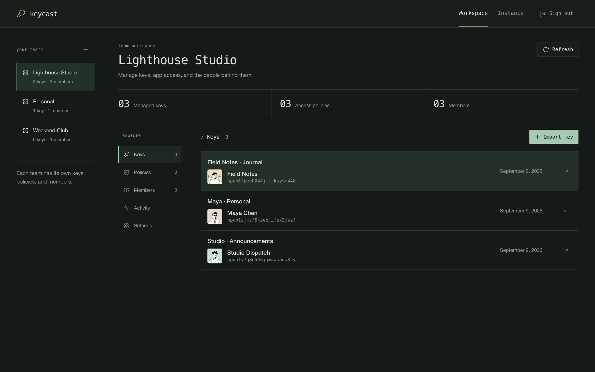

Keys have their own names, public profiles, and app access. The team sidebar keeps shared identities
separate from a personal workspace. [Getting started](getting-started.md) walks through setup.

| Welcome | A new team |
|---|---|
| [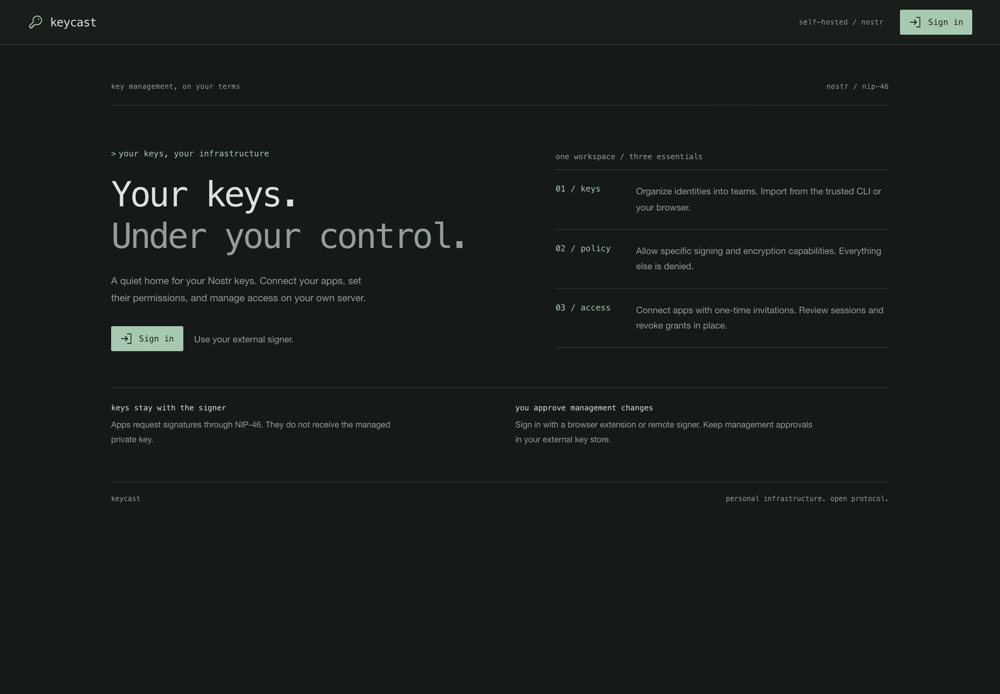](images/welcome.png) | [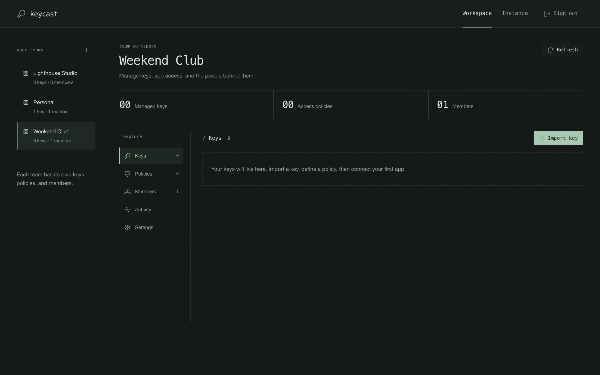](images/empty-workspace.png) |
| Sign in with an external management signer. | Import a key, define a policy, then connect an app. |

## Sign in and pair an app

The management signer approves administration. Connected Nostr apps use hosted keys under a grant.
See [the two connections](getting-started.md#two-connections-two-purposes).

| Sign in | Import a key |
|---|---|
|  |  |
| Choose the signer holding your management identity. | Browser import explains its trust boundary; trusted CLI import is also available. |

| Connect an app | Invitation ready |
|---|---|
|  |  |
| Give the connection a purpose and choose its permissions. | The complete invitation URL is masked here; treat yours as a secret. |

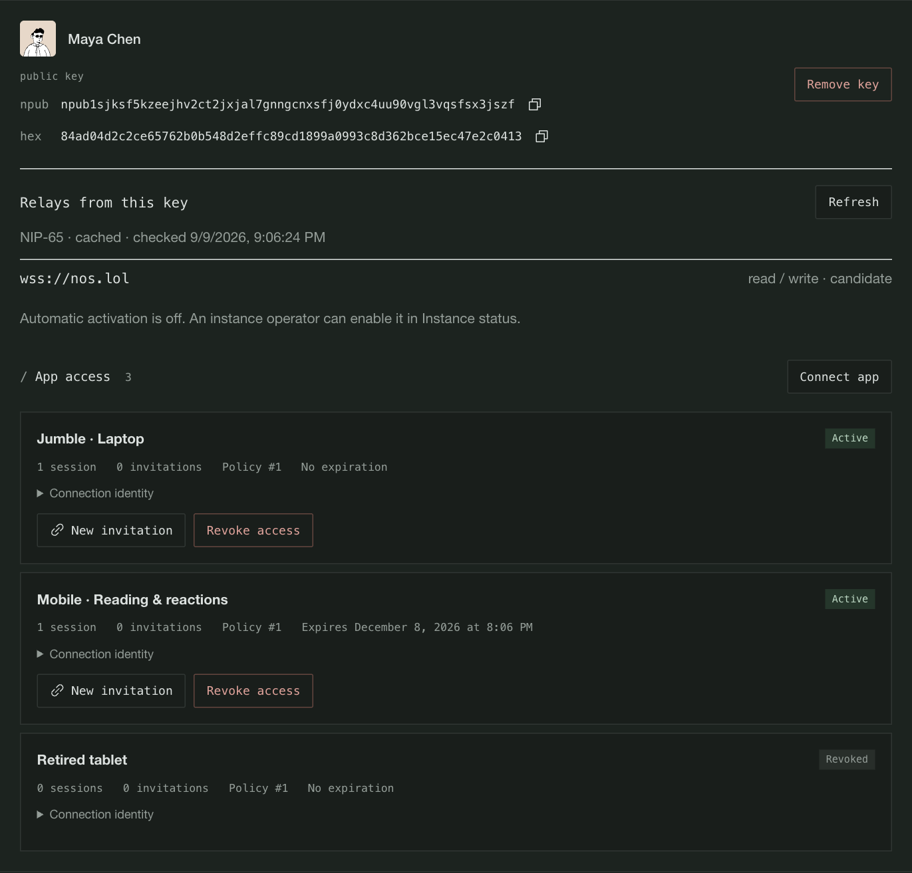

Two grants have a connected session; an older tablet's grant is revoked. The cached NIP-65 list is
shown separately from app access. Client labels are illustrative: the sessions were exercised with
a NIP-46 test client, not the named third-party applications.

## Teams and roles

[Management roles](policies-and-access.md#management-roles) control who can view or change a team.
These views come from separate authenticated administrator and member sessions.

| Administrator | Member |
|---|---|
| [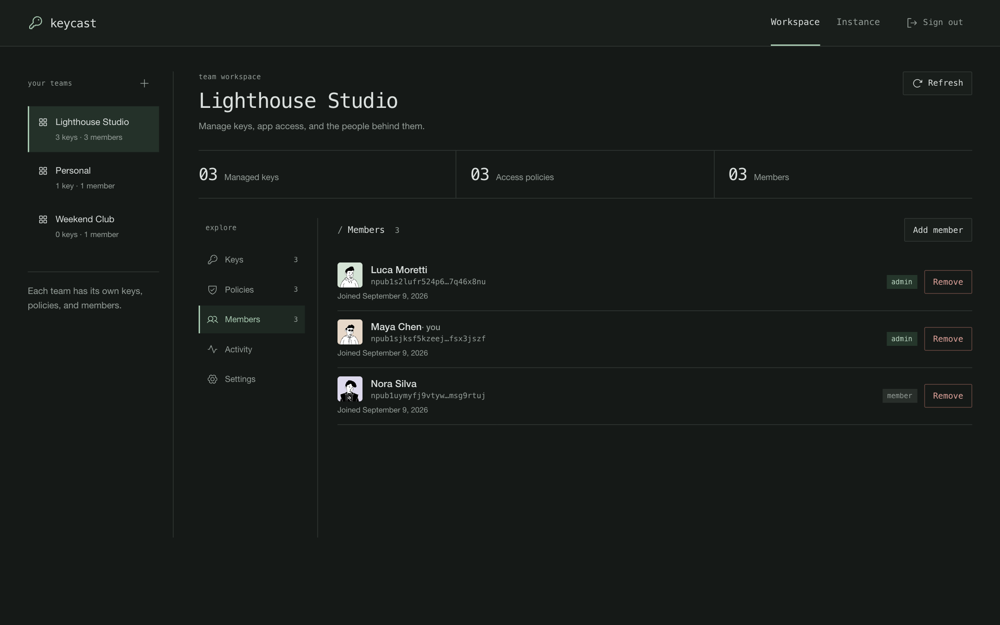](images/members.png) | [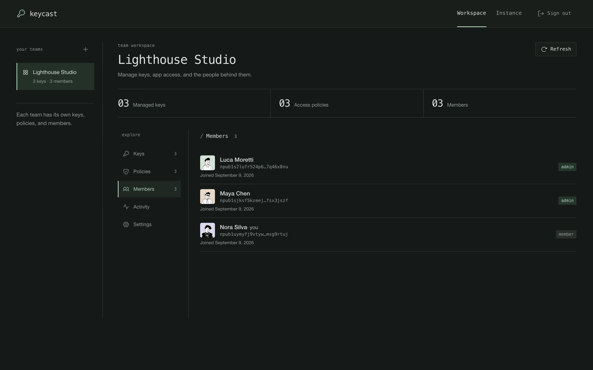](images/member-view.png) |
| Maya and Luca administer Lighthouse Studio. | Nora can view her team; she has no operator or team administration controls. |

| Team settings | Activity |
|---|---|
| [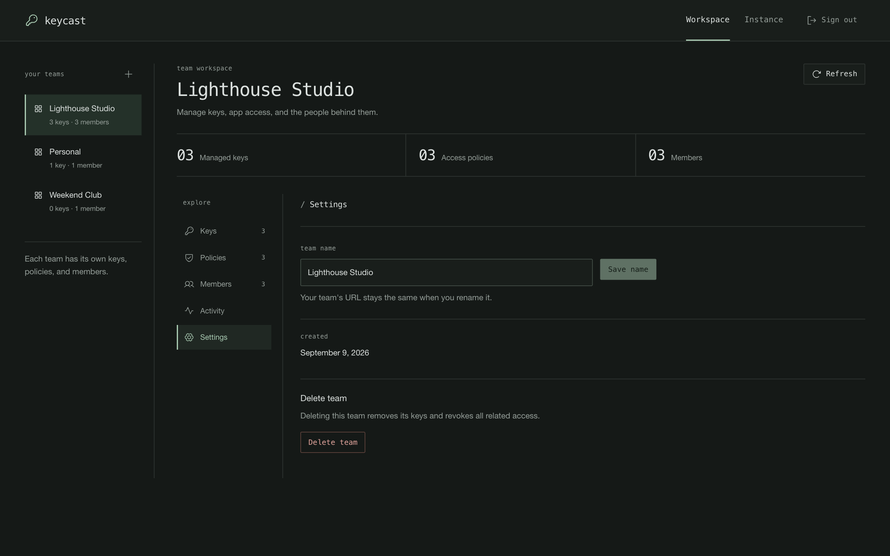](images/team-settings.png) |  |
| A team can be renamed while keeping its URL. | Retained actions show outcomes and the approving actor. |

## Policies

[Policies and access](policies-and-access.md) explains event kinds, separate encryption permissions,
and how edits affect connected apps.

| Policy list | Policy editor |
|---|---|
| [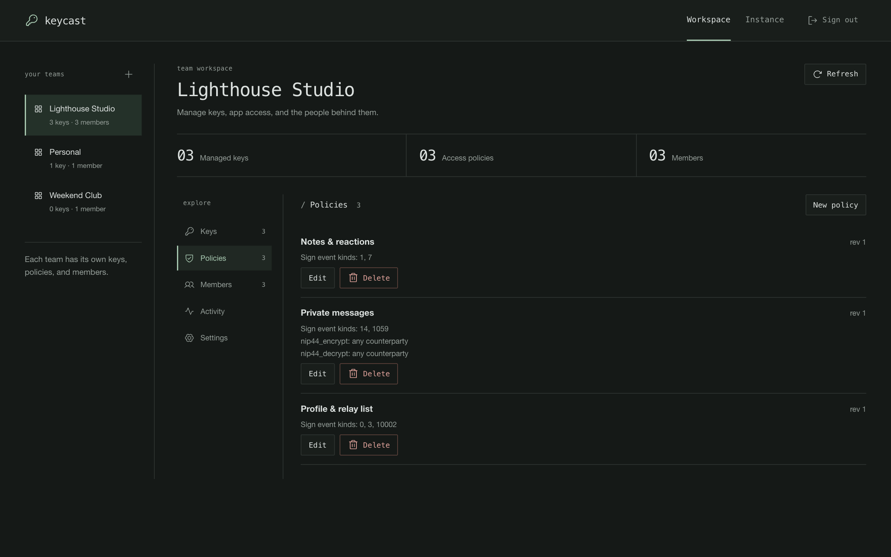](images/policies.png) | [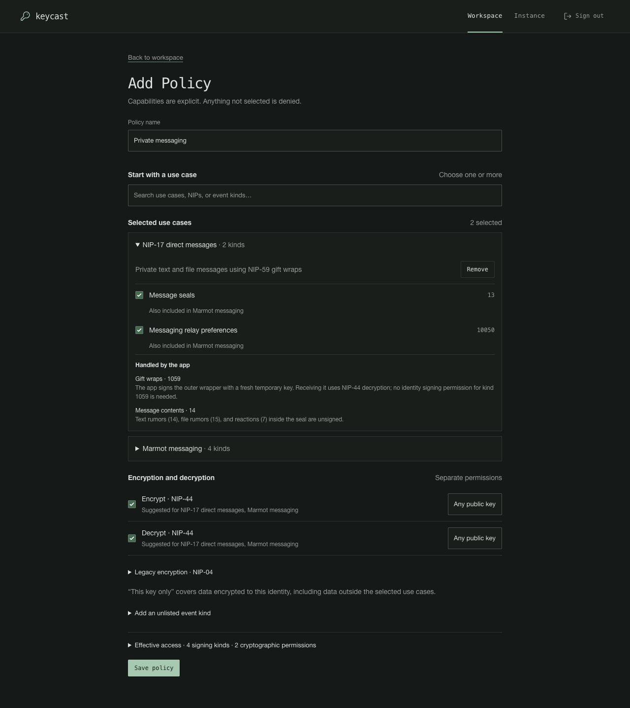](images/policy-editor.png) |

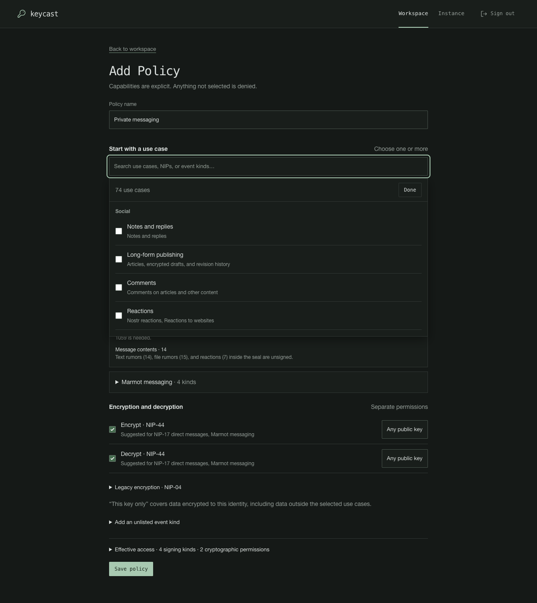
| Use named policies for different purposes. | Grant only the operations a client needs; omitted capabilities are denied. |

## Instance operations

An [instance operator](operations.md#instance-status-and-access) can inspect signing readiness,
storage, activity counts, and relay configuration. The demo enabled only `wss://nos.lol`.

| Baseline relays | Imported-key discovery |
|---|---|
| [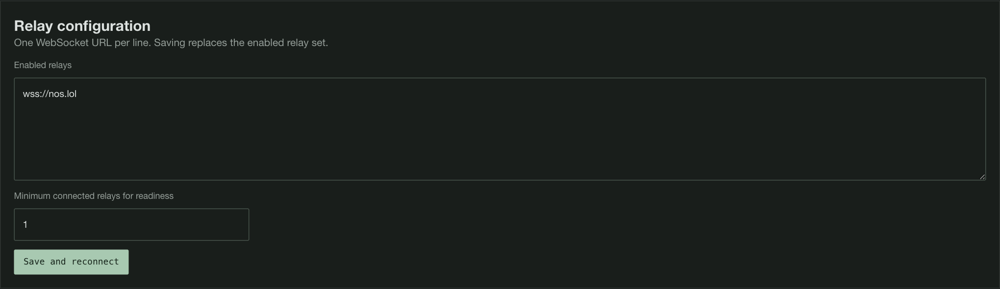](images/relay-configuration.png) | [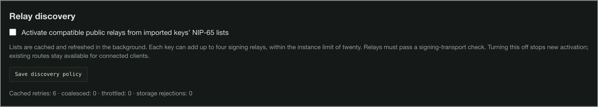](images/relay-discovery.png) |
| Set enabled routes and the readiness threshold. | Decide whether compatible cached NIP-65 routes can activate automatically. |

Expand the relay diagnostics screenshot

[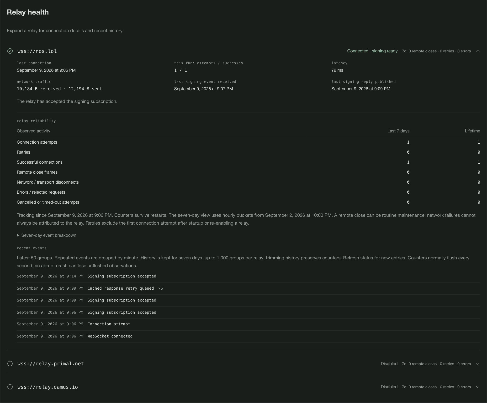](images/relay-diagnostics.png)

These are observations from a short demo run. Use the [relay guide](relays.md#read-diagnostics) to
interpret subscription, request, and reply checkpoints separately from the connection count.

## Backup and recovery

The demo took an encrypted online backup, rotated its root credential, and restored the archive
into a separate directory. [Backup and recovery](backup-and-recovery.md) covers the host commands
and review required before resuming signing.

A local backup timestamp confirms the local operation. Off-host storage and recovery testing are
separate steps.

A changed identity requires comparison with trusted host status before the browser trusts it again.

Restore revokes old access and pauses signing for review. Management remains available to repair
and review the restored state.

## On a small screen

<a href="images/workspace-mobile.png">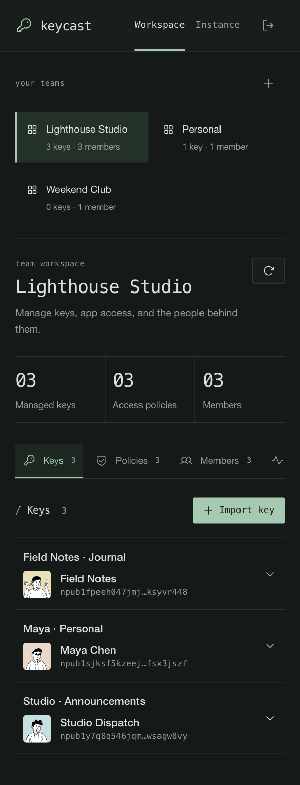</a>

The same populated workspace in a mobile viewport.

## About these captures

Except for the policy editor and picker refresh described below, captured on September 9, 2026 from source revision
[`0aae2ee0d5fa5b54a76aeb5d2eaebb5ac906018f`](https://github.com/marmot-protocol/keycast/commit/0aae2ee0d5fa5b54a76aeb5d2eaebb5ac906018f),
using the Rust signer and API with the SvelteKit development server. Chrome 152 was automated with
Playwright at a 1440-pixel desktop width and a 390-pixel mobile width, with a 1.5 device scale.
Some images capture an individual panel so its controls remain readable in a guide.

The isolated instance used fresh disposable keys and a private temporary database/root credential.
Six fictional profiles were published to `nos.lol`: Maya Chen, Luca Moretti, Nora Silva, Field Notes,
Studio Dispatch, and Pocket Notebook. Their metadata identifies them as documentation demos.
The populated teams, policies, and grants were created through signed management requests. Browser
sign-in used a test NIP-07 adapter with the demo signing keys held outside the browser; it did not bypass
server authorization. Two NIP-46 clients paired through `nos.lol` and received verified event signatures.
The signed sample notes were not published.

The September 9 UI and status values were not mocked. The invitation screenshot masks the entire bunker URL,
and the import screenshot leaves the private-key field empty. Captures contain no private keys,
root credentials, or usable invitations. This gallery illustrates these workflows; its counters
are not an availability benchmark or a compatibility claim for named Nostr apps.

The policy editor and picker images were refreshed on September 10, 2026 from the production
SvelteKit build containing the searchable policy editor. They show the real form with local API
test fixtures and a disposable external test signer, at a 1280-pixel desktop width. These captures
illustrate permission selection; they do not demonstrate live relay or client compatibility.

Avatars use [DiceBear's Notionists style](https://www.dicebear.com/styles/notionists/) by
[Zoish](https://bio.link/heyzoish), available under
[CC0](https://creativecommons.org/publicdomain/zero/1.0/).
For refresh guidance, see [Updating screenshots](development/README.md#updating-screenshots).
